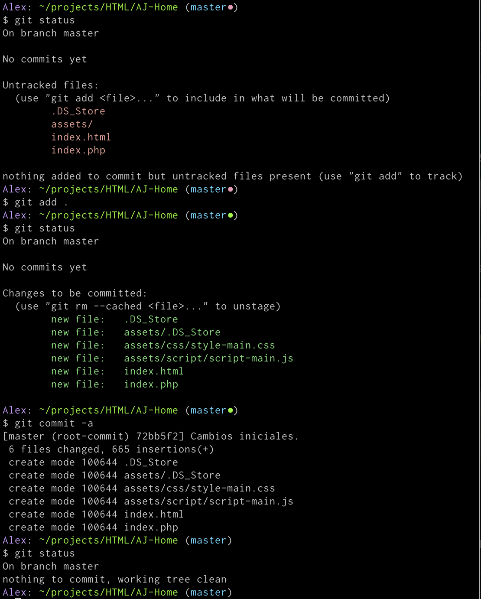
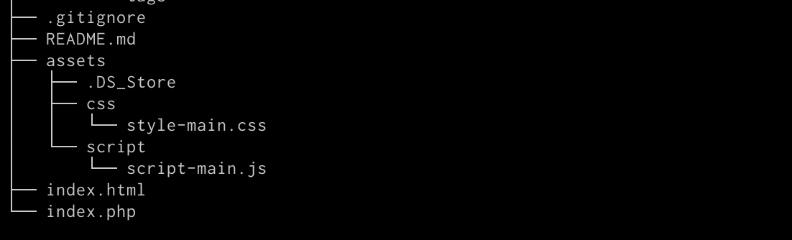
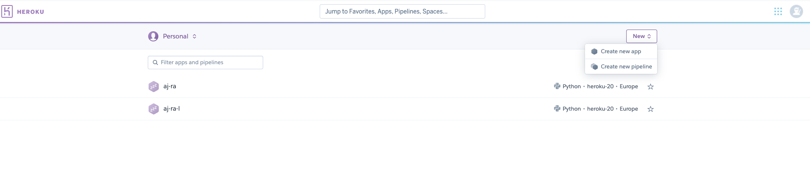

## Introduccion.
<a name="introduccion"></a>

Heroku es servicio de plataforma en la nube (PaaS - Platform as a Service) que permite a los desarroladores construir, ejecutar y operar aplicaciones, todo de forma remota o en la nube.

Te permite crear diferentes tipos de cuentas, segun tus necesidades:

* Gratuita y/o hobby.
* Produccion ($25 o mas por mes).
* Avanzada ($250 o mas por mes).
* Empresarial. Hay que contactar a heroku para estimados.

## Crear cuenta de Heroku.
## Subir una paguina estatica.

Estos son los pasos para subir una paguina sencilla (HTML, CSS y JS) a heroku.

1. En la carpeta de mi proyecto, tengo que crear una archivo "index.php", quedando asi:

2. Inicializo el repositorio git:

	```bash
	$ git init
	```
	
3. Actuazo la rama master: (mas informacion en [git]())

4. Verificamos que estamos al final de la rama:

5. Nuestra carpera luce asi:

6. Vamos a [github](https://github.com/home) y creamos un repositorio nuevo.
7. Para subir la carpeta a github tenemos dos formas de hacerlo:
	- Desde la paguina de GitHub.
	- Por consola. Yo utilice la de consola que es mas rapida, una vez que te acostumbras.
8. Desde la consola, creamos una rama remota:

	```bash
	$ git remote add origin https://github.com/AlejandroRodriguezA/AJ-page.git
	```
9. Renombramos la rama principal con el nombre de "main".
	
	```bash
	$ git branch -M main
	```
10. Subimos o "Push" la carpeta hacia Github:

	```bash
	$ git push -u origin main
	remote: Support for password authentication was removed on August 13, 2021. Please use a personal access token instead.
remote: Please see https://github.blog/2020-12-15-token-authentication-requirements-for-git-operations/ for more information.
fatal: Authentication failed for 'https://github.com/AlejandroRodriguezA/AJ-page.git/'
	```
	Nota: No subio la informacion, cuando voy a la paguina que me indican, veo que hace falta tener activado el sistema de autenticacion de dos factores o "Two-factor Authentication".
	
	Existen dos formas de conectarse, por consola, con github:
	* HTTPS.
	
	```bash
	$ git remote add origin https://github.com/AlejandroRodriguezA/x.git
	$ git branch -M main
	$ git push -u origin main
	```
	* SHH.
	
	```bash
	$ git remote add origin git@github.com:AlejandroRodriguezA/x.git
	$ git branch -M main
	$ git push -u origin main
```
11. La mejor forma es por SHH, por simplicidad utilice HTTPS,pero desde August 13, 2021 ya no se puede utilizar, asi que hay que [crear un token de acceso personal:](https://docs.github.com/en/github/authenticating-to-github/keeping-your-account-and-data-secure/creating-a-personal-access-token). 
12. Subimos o "Push" la carpeta hacia Github:

	```bash
	$ git push -u origin main
	Username for 'https://github.com':
	Password for 'https://***********@github.com':
	```
	
13. En el password colacamos el token que generamos.
	
	```bash
	Alex: ~/projects/HTML/AJ-Home (main)
	$ git push -u origin main
Username for 'https://github.com': r***************z@gmail.com
	Password for 'https://r***************z@gmail.com@github.com':
	Enumerating objects: 15, done.
	Counting objects: 100% (15/15), done.
	Delta compression using up to 8 threads
	Compressing objects: 100% (11/11), done.
	Writing objects: 100% (15/15), 5.65 KiB | 2.82 MiB/s, done.
	Total 15 (delta 2), reused 0 (delta 0), pack-reused 0
	remote: Resolving deltas: 100% (2/2), done.
	To https://github.com/AlejandroRodriguezA/AJ-page.git
	 * [new branch]      main -> main
	Branch 'main' set up to track remote branch 'main' from 'origin'.
```
	Si la opcion que prefieres es la de HTTPS y no quieres estar pegando el token cada vez que haces una conexion [aqui hay mas informacion](https://docs.github.com/en/get-started/getting-started-with-git/caching-your-github-credentials-in-git), para guardar el token.
	
14. Una vez que tenemos la carpeta en github, tenemos dos opciones:
	- Hacer en GUI. Entonces vamos a [heroku](https://www.heroku.com/home).
15. En el Dashboard, creamos una nueva app.

16. Seleccionar conectar con GitHub y luego click al boton "Connect to GitHub"
17. Autorizo a Heroku.
18. Indico el nombre del repositorio en el github, en mi caso "AJ-page" y conectar
19. Opcional habilitar las actualizacion automaticas de github.
	- Hacerlo por consola: 
20. "Deploy Branch".
21. dsafasdfasdfasdfasd
22. asddsafdsafasdf
23. asdasdfadsf
21. 


3. dkfhasdhfkj