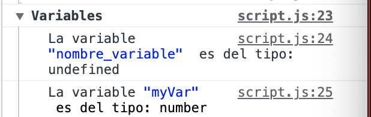

## Base JavaScripts.


## Introduccion.
<a name="introduccion"></a>	

- JS es un leguaje de programacion Interpretado que se difiere a un leguaje compilado, es decir, se ejecuta en el navegador,en el inteprete.  
- Es Orientado a objetos.  
- Es Imperativo. Se va ejecutando linea a linea.
- Es Case sensite.
- Basado en prototipos / instancias / clases.
- Tipado debil. Significa que el valor de los datos y variables puede ir variando durante el tiempo.Se define como string al comienzo y luego se redefine como interger.
- Lenguaje dinnamico. El dato se ajusta a la variable.
- Esta construido sobre ECMASCRIPT (5, 6, 7, 8, Next).
	
* <a name="Usos"></a>Para que se usa:	<small>[video](https://www.youtube.com/watch?v=z95mZVUcJ-E&t=1346s)</small>
	- Dinamismo de los sitios web
	- Servidor en NodeJS
	- Tecnologias Frontend como Angular, React o Vue.
	- Mobile Apps.
	- Desktop Apps.
	- Inteligencia Artificial. No es muy usual, pero se puede usar.
	
* <a name="Enlace"></a>Como enlazar JS:
- En linea: Dentro de la etiqueta del HTML, como en un ```<h2>``` se agrega el evento y la/s instrucciones, como por ejemplo:  
	
	```html
	<h1 onclick="alert('hola')"> Saludo </h1>  
	```    
	
- Dentro de la etiqueta ```script```: En HTML existe una etiqueta ```<script> </script>``` donde va contenidas las instrucciones de JS.    
	 
	```html
	<script type="text/javascript">
		alert('Hola desde script');
	</script>   
	```
**NOTA:** Usualmente, la etiqueta o "tag" ```script``` va al final, justa antes del ```</body>```.
		    
- Enlazado desde un archivo externo:  Es la forma mas usual de trabajar y se usa el "tag de HTML" ```script``` pero no colocando las instrucciones de JS, sino la direccion o link a un archivo donde estan todos los comandos y logica de nuestro programa.
 	
	```html
	<script src="Escrito/poryectos/claseJsAR/codigo.js" type="text/javascript"></script>
	```

## Libros Gratis de JS.

* [Goal Kicker](https://goalkicker.com/). Tiene "notas" de varios lenguajes de programación, entre ellos JS. Muy bueno para tener a mano si no tienes acceso a internet.
* [EloquentJavaScript.net](https://eloquentjavascript.net/). Es muy interesante, pero "no se puede" descargar gratis, es decir, lo puedes leer on-line o comprarlo.
* Hay muchos más, solo googlealo!!!


## Consola.
<a name="consola"></a>

Todos los navegadores modernos soportan la escritura de mensajes por consola usando diferentes "logging methods" o metodos de log. Existen cuatro categorías de salida, utilizando los siguientes metodos:

- ```console.log()```.El mas usado y comun.

Los siguentes muestran el simbolo respectivo junto con el mensaje.

- ```console.info()```.
- ```console.warn()```.
- ```console.error()```.

La consola es usada fundamentalmente para depurar o probar nuestro codigo, conocido como **"debugging purposes"**.

- En **chrome** la ruta es: "View -> Developer -> JavaScript Console". 

	- En MAC (option+command+J) o (⌥ + ⌘ + J).
	- En Windows/linux (Shift+CTRL+J).

- En **Firefoz** la ruta es: 	"Tools -> Browser Tools -> Web Browser Tools ".

	- En MAC (option+command+I) o (⌥ + ⌘ + I).
	- En Windows/linux (Shift+CTRL+K).

### El formato de la salida por consola.

Muchos de los metodos de impresion por consola or (console's print methods) son manejados como "C-like" formatos de strings, es decir, parecidos a como maneja C los formatos de string.

	```js
	console.log('Capitulo: %s de string, seccion %d Consola','Formato',1);
	```

La lista completa de formatos es:

- %s		Formatea el valor como un string.
- %i o %d	Formatea el valor como un integer(numero).
- %f		Formatea el valor como un floating
- %o		Como un objeto expandible del DOM.
- %0		Como un objeto de JS.
- %c		Aplica CSS styles.

	```JS
	console.log ('%cCapitulo: %cConsola y sus formatos de salida',"color:blue;font-size:large","font-size:mediun")
	```

### Usando grupos para las impresiones por consola.

Las agrupaciones de las impresiones por consola nos permiten agrupar mejor los resultados para tener una mejor idea o vision de los resultados. Existen dos formas de agrupar:

-	Grupos Colapsados. La informacion del grupo no se muestra o despliega hasta que se lo indiques en la consola. Como por ejemplo:

	```js
	console.groupCollapsed("Grupos Colapsados");
	console.log("Aqui las salidas");
	console.log("que necesite hacer no importan si son %i o %i",1,1000);
	console.groupEnd();
	```

- Grupos Desplegados. La informacion se muestra desde el principio.

	```js
console.group("Grupos desplegados");
console.log("Importante recordar que ambos tienen que terminar con console.groupEnd();")
console.group("Nivel 2");
console.info("La agrupacion puede contener niveles");
console.warn("Mensajes de alerta");
console.error("o mensajes de error");
// console.log("La agrupacion puede contener niveles");
console.groupEnd();
console.groupEnd();
	```

**NOTA:** Un funcionalidad interesante es que se pueden mostrar subgrupos, como se puede observar en el ejemplo anterior. Si quieres mas informacion sobre las opciones y metodos disponibles puedes ir a la documentacion de [MDN Web Docs.](https://developer.mozilla.org/es/docs/Web/API/Console)

<a name="Comentarios")></a>
## Comentarios.
Para comentar el codigo:
		Los comentarios son lineas de codigo que JS ignora. Los comentarios son un gran forma de dejar notas para uno mismo o para que otra persona entienda el codigo.
	
	Hay dos formas de escribir comentarios en JS:
	
	 - Comentario "In-line" o comentario en linea:
	 
	 ```js
	 // Este es un comentario.
	 console.log("Hola"); // Imprime por consola el mensaje.
	 ```
	 - Comentario "multi-line":
	 
	 ```js
	 /* Los comentarios tambien
	 pueden ser de varias lineas.
	 
	 Este se utiliza, normalmente, para comentar
	 codigo y verificar el funcionamiento del
	 programa sin este codigo.*/
	 ```

<a name="Declarar_variables"></a>
## Variables.

Las variables en JS se declaran usando la palabra reservada ```var <nombre_variable>;``` o ```let <nombre_variable>;```. 

El nombre de la variable puede ser compuesto de numeros, letras, "\$" y/o  "_," pero no puede tener espacios en blanco ni comenzar con numeros.

 **NOTA:En JS se termina cada declaracion con " ; ".**
 
### Diferencias entre let y var.

Hay muchas/varias diferencias entre ```let``` y ```var``` y puedes [profundizar en](https://developer.mozilla.org/en-US/docs/Web/JavaScript/Reference/Statements/let), aqui las que más uso:

* **Declaración:**
	* ```Var``` no necesita ser declarada para poder utilizarla, aunque es recomendable.
	* ```let``` necesita ser declarada e inicializada para poder leerla.
	
	```js
	//Funciona
	myName = 'Chris';
	
	function logName() {
	  console.log(myName);
	}
	
	logName();
	
	var myName;
	```

	**Nota:** Esto funciona por el [var hosting](https://developer.mozilla.org/en-US/docs/Web/JavaScript/Reference/Statements/var#var_hoisting) para más información, pero basicamente es 	que las variables (declaraciones en general) son procesadas **ANTES** que el codigo se ejecute.


	```js
	console.log(bar); // undefined
	console.log(foo); // ReferenceError
	var bar = 1;
	let foo = 2; // End of TDZ (for foo)
	```
	
	Nota que la variable **bar** queda como "undifined", mientras que la variable **foo** da un error de refencia.[End of TDZ](https://developer.mozilla.org/en-US/docs/Web/JavaScript/Reference/Statements/let#temporal_dead_zone_tdz) se refiere a que se guarda en una zona temporal hasta la inicializacion fue completada y va en orden de ejecución.
	
	
* **Alcance**.Cuando son declaradas en nivel superior del programa o de la funcion:
	* ```var``` crea una propiedad en el objeto global.
	* ```let``` no lo hace.
	
	
	```
	var x = 'global';
	let y = 'global';
	console.log(this.x); // "global"
	console.log(this.y); // undefined
	```
	
* **Re-declaracion:**
	* ```var``` permite redeclaracion de variables.
	* ```let``` no lo permite.
	
	
	```
	let foo;
	let foo; // SyntaxError thrown.
	  	
	// Con var si se puede hacer:
	var foo;
	var foo=4;
	``` 	
	

### Definiendo Variables.

Para inicializar la variable o asignarle valor, se utiliza el operador de asignacion (```=```).

```js
var myVar = 1;
```

En este punto tenemos dos (2) variables definidas, una que fue asignado ningun valor y la otra fue asignada con el valor "1". JS al no asignarle valor le asigna el valor "undefined" o no definido y cuando le asignamos un numero esa variable es un "number".

```js
var nombre_variable;
var myVar = 1;
console.groupCollapsed("Variables")
    console.log("La variable %c\"nombre_variable\" ","color:blue","es del tipo: ",typeof(nombre_variable));
    console.log('La variable %c"myVar"%c es del tipo: %s',"color:blue","color:black",typeof(myVar));
console.groupEnd();
```

dando como resultado:


**NOTA** todas las variables y funciones son "case sensitive" es decir, que diferencia entre mayusculas y minusculas.

**Best Practice** o mejores practicas para nombrar una variable o funcion en JS es con ***camel case***. Si una variable esta compuesta por varias palabras, la primera se escribe con minuscula y las subsiguientes con mayusculas sin espacio y/o simbolo alguno, por ejmplo:

```js
var someVariable;
var anotherVariableName;
var thisVariableNameIsSoLong;
```

#### Usando los "Short-circuiting" o valor por defecto de una variable.

Cuando se esta [desestructurando](https://developer.mozilla.org/en-US/docs/Web/JavaScript/Reference/Operators/Destructuring_assignment) un objeto o un vector a variables se les puede asignar variables por defecto:


```
let a, b;

[a=5, b=7] = [1];
console.log(a); // 1
console.log(b); // 7


```

**En la seccieon de vectores y objetos  lo explico con más detalle.**


### Tipos de variables o Datos:

JavaScript tiene ocho (8) direfentes tipos de data:

- ```undefined```.
- ```null```.
- ```boolean```. Pueden ser true o 1, o false o 0.
	
	```js
	var myBoolean = true; // 1-bit true/false (0 or 1) 
	var myBoolean2 = false;
	```
- ```string```. Los string se declaran usando las doble comillas.

	```js
	var miNombre = "Alejandro";
	
	// En caso de necesitar usar las "" dentro del string, se usa el simbolo de escape \.
	var miApellido = "Rodriguez \"Alvarez\".";
	
	```
		
- ```symbol```.
- ```bigint```.
- ```number```. Aqui mas ejemplos de numeros:

	```js
	var myInteger = 12; // 32-bit number (from -2,147,483,648 to 2,147,483,647)
var myLong = 9310141419482; // 64-bit number (from -9,223,372,036,854,775,808 to 9,223,372,036,854,775,807)
var myFloat = 5.5; // 32-bit floating-point number (decimal)
var myDouble = 9310141419482.22; // 64-bit floating-point number

	```
	
- ```object```.


<a name="Operadores_Matematicos"></a>
## Operadores Matematicos.

- Suma: Se usa ```+```.
- Resta: Se usa ```-```.
- Multiplicacion: Se usa ```*```.
- Division: Se usa ```/```.
- El "resto" de una division se utiliza ```%```. Por ejemplo:
	
```js
17 % 2 = 1 //(17 is Odd)
48 % 2 = 0 //(48 is Even)
```
	
- Incremento de unidad.
	
```js
// Se puede incrementar uno a la variable
var i;
i++;
// Es equivalente a decir:
i = i + 1
```
	
Tambien se puede incrementar mas que la unidad, una suma abreviada:
	
```js
var myVar = 1;
myVar += 5;
	
console.log ("El resultado es: ", myVar);
//El resultado es:  6
```
	
	
- Descremento.
	
```js
// Se puede restar uno a la variable
var i;
i--;
// Es equivalente a decir:
i = i - 1
```
	
<a name="Strings"></a>	
## Strings:

1. Los Strings se pueden declarar usando las comillas dobles " o simples ' y desde (ES20015, ES6) se puedes utilizar los "backticks" en los Templates.Pueden ser utilizadas indistintamente, siempre que se empiece y termine con las mismas.
	
	```js
	doubleQuoteStr = "This is a string"; 
	singleQuoteStr = 'This is also a string';
	backTicks = `This is also a string`;
	```
<a name="conversion"></a>
2. Pueden ser creados o transformados desde otro tipo de datos: 

- La funcion ```String()```.

```js
	var intString = String(32); // "32"
	var booleanString = String(true); // "true" 
	var nullString = String(null); // "null"
```

- La funcion ```toString()```, como por ejemplo:

```js
	var intString = (5232).toString(); // "5232"
	var booleanString = (false).toString(); // "false" 
	var objString = ({}).toString(); // "[object Object]"
```
- El metodo ```String.fromCharCode```.

```js
	String.fromCharCode(104,101,108,108,111) //"hello"
```

El objeto "String" tiene un metodo que devuelve un string creado de la secuencia de "UTF-14 code unit" ( Estos son numeros que van del 0 al 65535, para mas informacion sobre el metodo ```String.fromCharCode``` [ver la referencia en MDN Web Docs](https://developer.mozilla.org/en-US/docs/Web/JavaScript/Reference/Global_Objects/String/fromCharCode).

**Nota:** <a name="ASCII">ASCII<a/> (American Standard Code for Information Interchange). Para [ver la tabla, con la relacion entre el numero "Decimal" y su simbolo](https://www.ascii-code.com/), asi como otro tipo de representacion (OCT, HEX, BIN, HTML Nummber).


Aqui los caracteres "imprimibles" de la tabla ASCII.


|   DEC  |   OCT  |   HEX  |   BIN      |   Symbol  |   HTML Number  |   HTML Name  |   Description                             |
|--------|--------|--------|------------|-----------|----------------|--------------|-------------------------------------------|
|   32   |   40   |   20   |   100000   |           |   &#32;        |              |   Space                                   |
|   33   |   41   |   21   |   100001   |   !       |   &#33;        |              |   Exclamation mark                        |
|   34   |   42   |   22   |   100010   |   "       |   &#34;        |   &quot;     |   Double quotes (or speech marks)         |
|   35   |   43   |   23   |   100011   |   #       |   &#35;        |              |   Number                                  |
|   36   |   44   |   24   |   100100   |   $       |   &#36;        |              |   Dollar                                  |
|   37   |   45   |   25   |   100101   |   %       |   &#37;        |              |   Per cent sign                           |
|   38   |   46   |   26   |   100110   |   &       |   &#38;        |   &amp;      |   Ampersand                               |
|   39   |   47   |   27   |   100111   |           |   &#39;        |              |   Single quote                            |
|   40   |   50   |   28   |   101000   |   (       |   &#40;        |              |   Open parenthesis (or open bracket)      |
|   41   |   51   |   29   |   101001   |   )       |   &#41;        |              |   Close parenthesis (or close bracket)    |
|   42   |   52   |   2A   |   101010   |   *       |   &#42;        |              |   Asterisk                                |
|   43   |   53   |   2B   |   101011   |   +       |   &#43;        |              |   Plus                                    |
|   44   |   54   |   2C   |   101100   |   ,       |   &#44;        |              |   Comma                                   |
|   45   |   55   |   2D   |   101101   |   -       |   &#45;        |              |   Hyphen                                  |
|   46   |   56   |   2E   |   101110   |   .       |   &#46;        |              |   Period, dot or full stop                |
|   47   |   57   |   2F   |   101111   |   /       |   &#47;        |              |   Slash or divide                         |
|   48   |   60   |   30   |   110000   |   0       |   &#48;        |              |   Zero                                    |
|   49   |   61   |   31   |   110001   |   1       |   &#49;        |              |   One                                     |
|   50   |   62   |   32   |   110010   |   2       |   &#50;        |              |   Two                                     |
|   51   |   63   |   33   |   110011   |   3       |   &#51;        |              |   Three                                   |
|   52   |   64   |   34   |   110100   |   4       |   &#52;        |              |   Four                                    |
|   53   |   65   |   35   |   110101   |   5       |   &#53;        |              |   Five                                    |
|   54   |   66   |   36   |   110110   |   6       |   &#54;        |              |   Six                                     |
|   55   |   67   |   37   |   110111   |   7       |   &#55;        |              |   Seven                                   |
|   56   |   70   |   38   |   111000   |   8       |   &#56;        |              |   Eight                                   |
|   57   |   71   |   39   |   111001   |   9       |   &#57;        |              |   Nine                                    |
|   58   |   72   |   3A   |   111010   |   :       |   &#58;        |              |   Colon                                   |
|   59   |   73   |   3B   |   111011   |   ;       |   &#59;        |              |   Semicolon                               |
|   60   |   74   |   3C   |   111100   |   <       |   &#60;        |   &lt;       |   Less than (or open angled bracket)      |
|   61   |   75   |   3D   |   111101   |   =       |   &#61;        |              |   Equals                                  |
|   62   |   76   |   3E   |   111110   |   >       |   &#62;        |   &gt;       |   Greater than (or close angled bracket)  |
|   63   |   77   |   3F   |   111111   |   ?       |   &#63;        |              |   Question mark                           |
|   64   |   100  |   40   |   1000000  |   @       |   &#64;        |              |   At symbol                               |
|   65   |   101  |   41   |   1000001  |   A       |   &#65;        |              |   Uppercase A                             |
|   66   |   102  |   42   |   1000010  |   B       |   &#66;        |              |   Uppercase B                             |
|   67   |   103  |   43   |   1000011  |   C       |   &#67;        |              |   Uppercase C                             |
|   68   |   104  |   44   |   1000100  |   D       |   &#68;        |              |   Uppercase D                             |
|   69   |   105  |   45   |   1000101  |   E       |   &#69;        |              |   Uppercase E                             |
|   70   |   106  |   46   |   1000110  |   F       |   &#70;        |              |   Uppercase F                             |
|   71   |   107  |   47   |   1000111  |   G       |   &#71;        |              |   Uppercase G                             |
|   72   |   110  |   48   |   1001000  |   H       |   &#72;        |              |   Uppercase H                             |
|   73   |   111  |   49   |   1001001  |   I       |   &#73;        |              |   Uppercase I                             |
|   74   |   112  |   4A   |   1001010  |   J       |   &#74;        |              |   Uppercase J                             |
|   75   |   113  |   4B   |   1001011  |   K       |   &#75;        |              |   Uppercase K                             |
|   76   |   114  |   4C   |   1001100  |   L       |   &#76;        |              |   Uppercase L                             |
|   77   |   115  |   4D   |   1001101  |   M       |   &#77;        |              |   Uppercase M                             |
|   78   |   116  |   4E   |   1001110  |   N       |   &#78;        |              |   Uppercase N                             |
|   79   |   117  |   4F   |   1001111  |   O       |   &#79;        |              |   Uppercase O                             |
|   80   |   120  |   50   |   1010000  |   P       |   &#80;        |              |   Uppercase P                             |
|   81   |   121  |   51   |   1010001  |   Q       |   &#81;        |              |   Uppercase Q                             |
|   82   |   122  |   52   |   1010010  |   R       |   &#82;        |              |   Uppercase R                             |
|   83   |   123  |   53   |   1010011  |   S       |   &#83;        |              |   Uppercase S                             |
|   84   |   124  |   54   |   1010100  |   T       |   &#84;        |              |   Uppercase T                             |
|   85   |   125  |   55   |   1010101  |   U       |   &#85;        |              |   Uppercase U                             |
|   86   |   126  |   56   |   1010110  |   V       |   &#86;        |              |   Uppercase V                             |
|   87   |   127  |   57   |   1010111  |   W       |   &#87;        |              |   Uppercase W                             |
|   88   |   130  |   58   |   1011000  |   X       |   &#88;        |              |   Uppercase X                             |
|   89   |   131  |   59   |   1011001  |   Y       |   &#89;        |              |   Uppercase Y                             |
|   90   |   132  |   5A   |   1011010  |   Z       |   &#90;        |              |   Uppercase Z                             |
|   91   |   133  |   5B   |   1011011  |   [       |   &#91;        |              |   Opening bracket                         |
|   92   |   134  |   5C   |   1011100  |   \       |   &#92;        |              |   Backslash                               |
|   93   |   135  |   5D   |   1011101  |   ]       |   &#93;        |              |   Closing bracket                         |
|   94   |   136  |   5E   |   1011110  |   ^       |   &#94;        |              |   Caret - circumflex                      |
|   95   |   137  |   5F   |   1011111  |   _       |   &#95;        |              |   Underscore                              |
|   96   |   140  |   60   |   1100000  |   `       |   &#96;        |              |   Grave accent                            |
|   97   |   141  |   61   |   1100001  |   a       |   &#97;        |              |   Lowercase a                             |
|   98   |   142  |   62   |   1100010  |   b       |   &#98;        |              |   Lowercase b                             |
|   99   |   143  |   63   |   1100011  |   c       |   &#99;        |              |   Lowercase c                             |
|   100  |   144  |   64   |   1100100  |   d       |   &#100;       |              |   Lowercase d                             |
|   101  |   145  |   65   |   1100101  |   e       |   &#101;       |              |   Lowercase e                             |
|   102  |   146  |   66   |   1100110  |   f       |   &#102;       |              |   Lowercase f                             |
|   103  |   147  |   67   |   1100111  |   g       |   &#103;       |              |   Lowercase g                             |
|   104  |   150  |   68   |   1101000  |   h       |   &#104;       |              |   Lowercase h                             |
|   105  |   151  |   69   |   1101001  |   i       |   &#105;       |              |   Lowercase i                             |
|   106  |   152  |   6A   |   1101010  |   j       |   &#106;       |              |   Lowercase j                             |
|   107  |   153  |   6B   |   1101011  |   k       |   &#107;       |              |   Lowercase k                             |
|   108  |   154  |   6C   |   1101100  |   l       |   &#108;       |              |   Lowercase l                             |
|   109  |   155  |   6D   |   1101101  |   m       |   &#109;       |              |   Lowercase m                             |
|   110  |   156  |   6E   |   1101110  |   n       |   &#110;       |              |   Lowercase n                             |
|   111  |   157  |   6F   |   1101111  |   o       |   &#111;       |              |   Lowercase o                             |
|   112  |   160  |   70   |   1110000  |   p       |   &#112;       |              |   Lowercase p                             |
|   113  |   161  |   71   |   1110001  |   q       |   &#113;       |              |   Lowercase q                             |
|   114  |   162  |   72   |   1110010  |   r       |   &#114;       |              |   Lowercase r                             |
|   115  |   163  |   73   |   1110011  |   s       |   &#115;       |              |   Lowercase s                             |
|   116  |   164  |   74   |   1110100  |   t       |   &#116;       |              |   Lowercase t                             |
|   117  |   165  |   75   |   1110101  |   u       |   &#117;       |              |   Lowercase u                             |
|   118  |   166  |   76   |   1110110  |   v       |   &#118;       |              |   Lowercase v                             |
|   119  |   167  |   77   |   1110111  |   w       |   &#119;       |              |   Lowercase w                             |
|   120  |   170  |   78   |   1111000  |   x       |   &#120;       |              |   Lowercase x                             |
|   121  |   171  |   79   |   1111001  |   y       |   &#121;       |              |   Lowercase y                             |
|   122  |   172  |   7A   |   1111010  |   z       |   &#122;       |              |   Lowercase z                             |
|   123  |   173  |   7B   |   1111011  |   {       |   &#123;       |              |   Opening brace                           |
|   124  |   174  |   7C   |   1111100  |   \|      |   &#124;       |              |   Vertical bar                            |
|   125  |   175  |   7D   |   1111101  |   }       |   &#125;       |              |   Closing brace                           |
|   126  |   176  |   7E   |   1111110  |   ~       |   &#126;       |              |   Equivalency sign - tilde                |
	
<small>**NOTA:** [la tabla fue convertida gracias a esta paguina ](https://www.tablesgenerator.com/markdown_tables#)</small>

- Tambien se puede crear un objeto "String" usando la palabra reservada ```new```, pero no es recomendado pues su comportamiento es de un objeto mas que un tipo de datos primitivo.

```js
	var objectString = new String("Yes, I am a String object"); 
	typeof objectString;//"object"
	typeof objectString.valueOf();//"string"
```
 

### Concanetacion.
	
	La concanetacion o union de dos o mas strings se realiza con el operador ```+``` o usando el metodo ```concat()``` del objeto String.
	
	Nota: La concanetacion no adiciona espacios en blanco o separacion entre los dos o mas strings.

	Ejemplos:

```js
var str = " a +" + 'b';
	
str += ".Tambien adiciona al string existente";
```

La interpolacion o la utilizacion de  variables en la construccion de strings.

```js
var myName = "Alex";
var myStr = "My name is " + myName + " and I am well";
var otraVariable = 2;

myStr += ".Tengo +" + otraVariable + " años de experiencia programando";

```

### length.

Para determinar la longitud o tamaño del string se usa el metodo ```.length```. Como por ejemplo ```console.log("Que tamaño tiene este 'String'");```

### Notacion de ```[]``` para leer el string.

La notacion de corchetes ```[]``` se utiliza para acceder a las diferentes posiciones dentro del string.

**NOTA**:Todo lo que utiliza esta notacion comienza de cero (0). Entonces para obtener el primer elemento de un string.

Y asi se pueden ir a cada uno de los elementos del string, como por ejemplo para acceder al ultimo se puede hacer...


```js
var xVariable = "Cualquier cosa";
console.log(xVariable[0]);
//regresa C.
console.log(xVariable[xVariable.length - 1]);
//regresa: a
```


### Entendiendo la Inmutabilidad de los STRING.

En JS, los Strings son inmutables, lo que significa que una vez que son creados no pueden ser alterados. Por ejemplo, el siguiente codigo:


```js
console.log("el String '" + xVariable + "' no ha cambiado");
```

### Separando el string en un "vector"	.

Lo primero es que un ```vector o array``` es una variable que puede almacenar varias variables en su interior.**NOTA:Esto se profundiza mas adelante.** y estas variables pueden ser de cualquier tipo. Para esto se utiliza el metodo ```split```.

Ejemplo:

```js
var s = "one, two, three, four, five";
console.log(s);
var sVector = s.split(", ");
console.log(sVector);
//resultado: (5) ['one', 'two', 'three', 'four', 'five']
//Nota: Note el espacio luego de la ,
```

p

4. Al trabajar con strings es importante el uso de caracteres de escape, como vimos anteriormente, aqui mas ejemplos utiles:
	
	```
	\'	single quote
	\"	double quote
	\\	backslash
	\n	newline
	\r	carriage return
	\t	tab
	\b	word boundary
	\f	form feed
	```
	
	```js
	var myStr = "FirstLine\n\t\\SecondLine\nThirdLine"; 
	
	/* 
	Resultado es:
	FirstLine
    	\SecondLine
	ThirdLine
	*/
	```

	
6. dasdasDAs
€